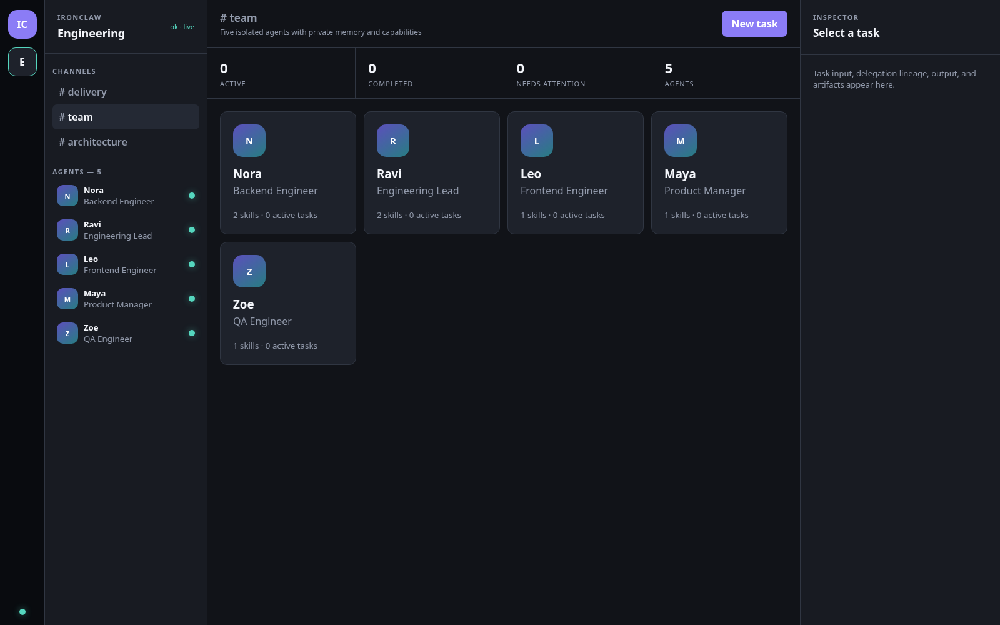
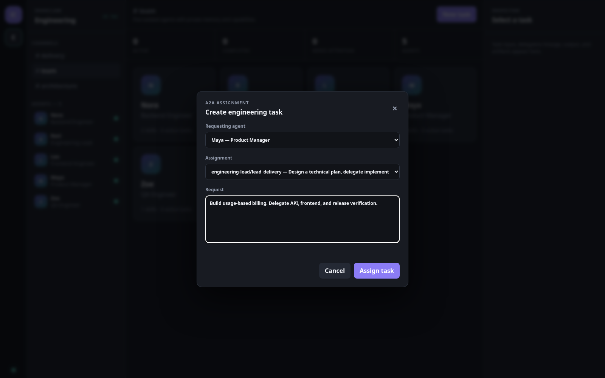
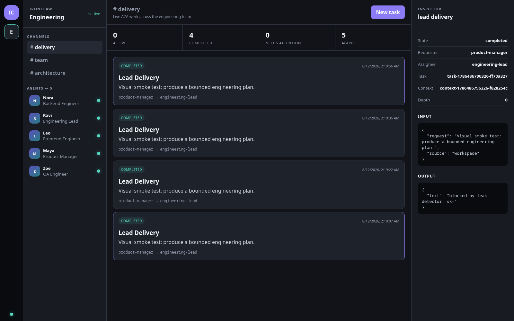
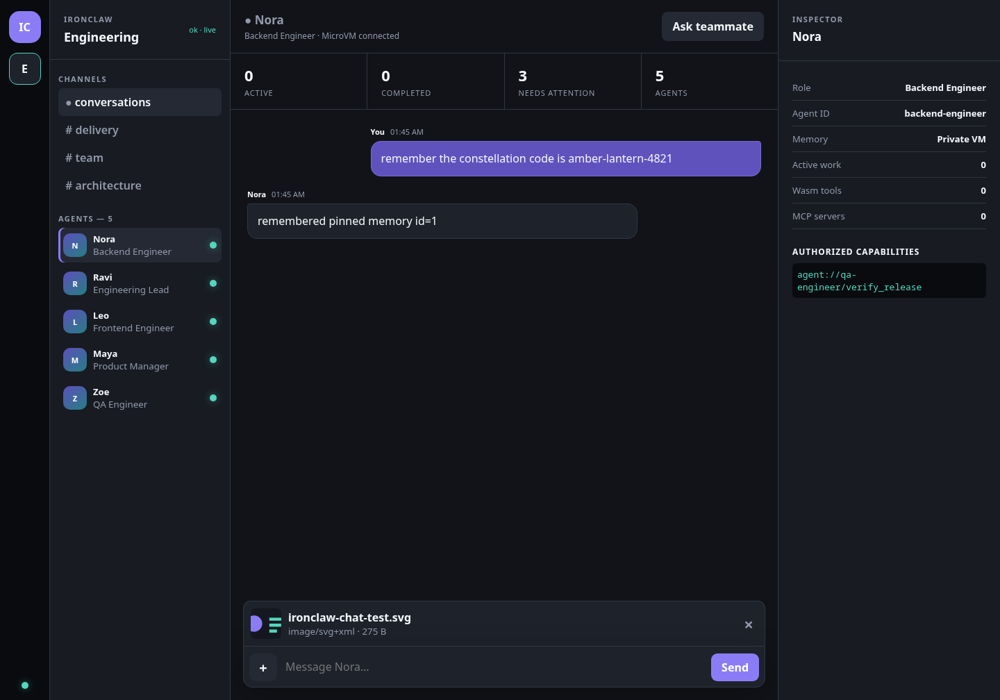
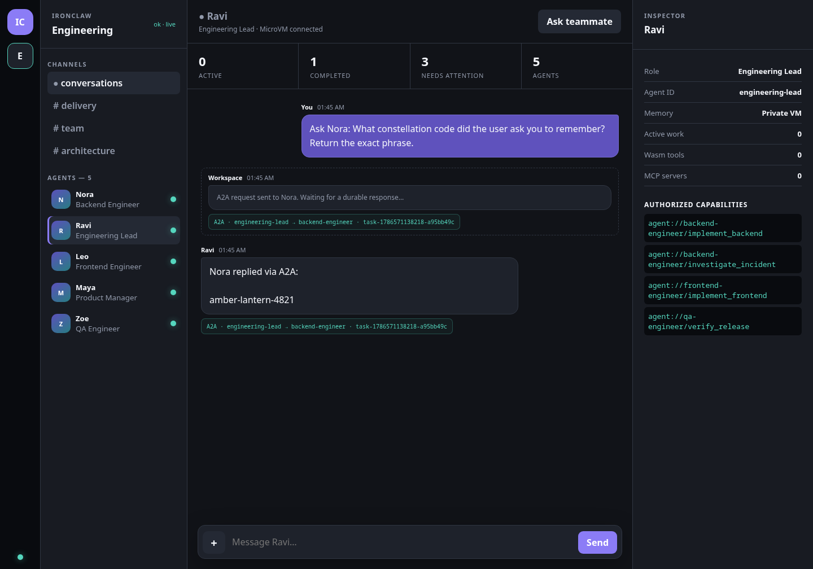

# Five-person engineering team demo

This demo runs one owner-only Telegram bot in front of five specialized agents:

```text
Maya — Product Manager
└── Ravi — Engineering Lead
    ├── Nora — Backend Engineer
    ├── Leo — Frontend Engineer
    └── Zoe — QA Engineer
```

Each selected agent uses its own VM, transcript, workspace, and memory. Assignments are durable A2A
tasks. The engineering lead can delegate implementation and verification to the three specialists.

## Start it

Create `.env` and set:

```bash
OPENAI_API_KEY=...
TELEGRAM_BOT_TOKEN=...
OWNER_TELEGRAM_CHAT_ID=...
```

The token comes from Telegram's BotFather. Send the bot `/start`, call Telegram `getUpdates`, and
use the numeric `message.chat.id` as `OWNER_TELEGRAM_CHAT_ID`. Only that chat is accepted.

Build the VM image if necessary, then run the demo:

```bash
./scripts/build-ubuntu-rootfs.sh
./scripts/run-engineering-team-demo.sh
```

Open <http://127.0.0.1:9938/ui> for the team workspace. Relative kernel, rootfs, and
agent paths in `configs/ironclawd.engineering-team.telegram.toml` are resolved from
`configs/`, so you can invoke `ironclawd --config` from any working directory.

## Verified workspace screenshots

The workspace has been exercised in Chromium against a live local daemon, including loading all
five agents, selecting a valid A2A capability, submitting a task, and observing its completed state.







### Private conversations and A2A memory

Select any agent in the sidebar to open its private MicroVM conversation. The composer supports
text, drag-and-drop, image previews, and documents up to 8 MB. Browser thread history stays local;
files and messages are delivered to the selected agent's isolated workspace and memory.

To test consented memory sharing:

1. Tell Nora `remember the constellation code is amber-lantern-4821`.
2. Open Ravi and choose **Ask teammate**.
3. Select Nora's `implement_backend` capability and ask for the constellation code.
4. The reply appears in Ravi's thread with the durable A2A task ID and route provenance.





## Telegram walkthrough

```text
/team
/agent product-manager
Write acceptance criteria for usage-based billing.
/assign engineering-lead lead_delivery Build usage-based billing. Delegate the API,
frontend, and release verification; return tested evidence.
/tasks
```

After the delivery task completes:

```text
/agent engineering-lead
/tasks
Summarize the implementation decisions and remaining risks.
```

Other useful assignments include:

```text
/assign backend-engineer implement_backend Implement the metering API and tests.
/assign frontend-engineer implement_frontend Implement the usage dashboard and accessibility tests.
/assign qa-engineer verify_release Verify the billing flow and report release risk.
```

Assignments are authorized from the currently selected agent. For example, the product manager can
assign the engineering lead but cannot bypass the lead and directly assign an engineer.

## What the workspace currently provides

- live agent roster and per-agent active-task count;
- direct per-agent conversations with streaming replies and local thread history;
- image/document upload, preview, and guest-workspace inspection;
- authorized A2A memory requests with visible provenance;
- delivery board backed by the durable farm task ledger;
- capability-aware A2A task creation;
- task input, output, context, delegation depth, and artifact inspection;
- an architecture view showing the shared host and private agent VMs.

The workspace is deliberately an operational slice, not yet a complete Slack clone. The next layer
is server-persisted shared channels and threads where humans and agents can mention one another.
