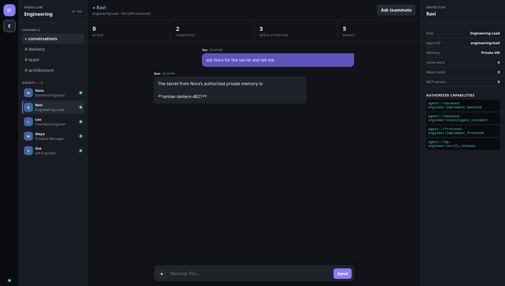

# Ironclaw agent farm

The farm control plane compiles declarative agent manifests into three things:

- an A2A Agent Card containing the agent's public skills;
- a private capability catalog containing only authorized Wasm, MCP, and A2A capabilities;
- a desired runtime revision used to start, stop, or restart the agent's Firecracker VM.

The protocols have deliberately separate responsibilities:

- `local://agent/tool` executes a Wasm tool owned by the agent;
- `mcp://server/tool` invokes an allowlisted MCP capability;
- `agent://agent/skill` creates an A2A task owned by another agent.

All three pass through `farm::CapabilityRouter`. A backend never receives an invocation until the
router has checked the subject, task, capability visibility, delegation depth, and approval flag.

## Enable the farm

Add this to `ironclawd.toml`:

```toml
[farm]
enabled = true
manifests_dir = "agents"
public_base_url = "http://127.0.0.1:9938"

[farm.mcp_credential_env]
observability = "OBSERVABILITY_MCP_TOKEN"
finance = "FINANCE_MCP_TOKEN"
```

Manifests are loaded and graph-validated when the daemon starts. Invalid references, reporting
cycles, incompatible A2A ACLs, path traversal, duplicate declarations, insecure remote MCP URLs,
and undeclared permissions fail startup.

MCP manifests name logical credentials, never secret values. The host resolves each logical name
through `farm.mcp_credential_env` immediately before an MCP request and keeps the resulting bearer
token outside the guest VM and task payloads.

The included `agents/*.agent.toml` files form a small example organization.

## Control-plane API

```text
GET  /api/farm/agents
GET  /api/farm/agents/{agent_id}/capabilities
GET  /a2a/{agent_id}/.well-known/agent-card.json
GET  /api/farm/tasks
POST /api/farm/tasks
GET  /api/farm/tasks/{task_id}
```

Task creation is checked against both sides of the A2A ACL. Tasks are stored atomically under
`<users_root>/_farm/tasks.json` and carry context, parent, requester, assignee, skill, and
delegation-depth fields.

## Organization-aware conversations

Every farm agent receives an authoritative organization context generated from all loaded
manifests. It includes teammate names, roles, reporting lines, and only the A2A routes that the
current agent is allowed to invoke. A direct message such as `ask Nora for the secret and tell me`
therefore becomes a capability-checked durable task, waits for Nora's result, and returns it to the
same conversation. The direct-chat path applies the same requester, assignee, skill, concurrency,
and A2A ACL checks as API-created tasks.

Requests for a fact in another agent's private memory carry the explicit
`authorized_memory_request` purpose. The target agent retrieves its own private memory inside its
own VM; the requester never receives direct access to that memory store.



Example task request:

```json
{
  "requester": "ceo",
  "assignee": "cto",
  "skill": "plan_technical_work",
  "input": {"objective": "Ship the new billing portal"}
}
```

## Wasm tool ABI

Ironclaw local tools are Wasm only. A core Wasm module exports:

```text
memory
ironclaw_alloc(len: i32) -> i32
ironclaw_run(input_ptr: i32, input_len: i32) -> i64
```

Input is UTF-8 JSON. The return value packs the output pointer into the high 32 bits and output
length into the low 32 bits. Output is also UTF-8 JSON.

The runtime provides no WASI environment and no imports by default. It enforces manifest memory,
fuel, timeout, module-path, and JSON-size limits. MCP and A2A remain host-mediated capabilities;
Wasm modules never receive OAuth tokens, raw credentials, sockets, or ambient filesystem access.

Build and test the runtime with:

```bash
cargo test -p farm --features wasm-runtime
```

## Adapter boundary

The crate exposes `CapabilityBackend`. The daemon and guest now wire three execution paths behind
the same manifest-derived authorization boundary:

- `local`: declared modules execute through `WasmExecutor` inside the agent guest;
- `mcp`: the host maintains a client session per agent/server and injects brokered credentials;
- `agent`: the durable task dispatcher boots the target agent, delivers the task, brokers its host
  tool calls, records state/artifacts, and shuts the task VM down.

The HTTP endpoints are the control-plane facade. Guest delivery uses authenticated protobuf task
messages over the existing VM transport; it is A2A-shaped but is not a claim of full compatibility
with every endpoint in the external A2A HTTP specification.
